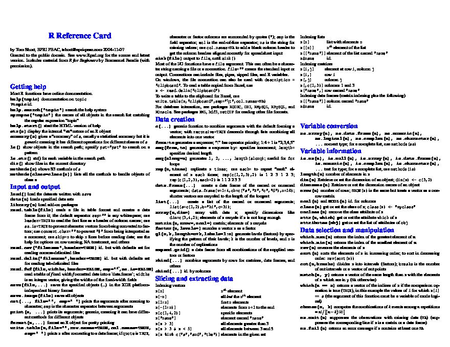

<!-- README.md is generated from README.Rmd. Please edit that file -->

```{r, include = FALSE}
knitr::opts_chunk$set(
  collapse = TRUE,
  comment = "#>",
  fig.path = "man/figures/README-",
  out.width = "100%"
)
```

# LMDX

<!-- badges: start -->

<!-- badges: end -->

A R implementation of LMDX ([Perot et al. 2023](https://arxiv.org/pdf/2309.10952.pdf)).\
You provides a pdf page (or pdf file) in, and a decoding schema (json), and you get all entities extracted from the pdf.

## Installation

You can install the development version of LMDX and its prerequisites from [GitHub](https://github.com/) with:

``` r
# install.packages("pak")
pak::pak("mlverse/chattr")
pak::pak("cregouby/LMDX")
```

## Example

We want here to extract the [**R short reference card pdf**](https://cran.r-project.org/doc/contrib/Short-refcard.pdf) file content, and turn it into a data.frame:



It is a challenge as it is composed of 3 tight columns and packed between code and highly summarized sentences.

## Step 1 : Design your taxonomy

The taxonomy here is a json representation of the entities to extract from the document. Depending on the LLM model capacity, taxonomy can be hierarchical like in the following example:

Here we can see that the document is structured in paragraphs like *Getting Help*, then *Input and output*, and so on. This is the first layer of the hierarchy, and each paragraph has a title and a description.\
Then for each paragraph, there is multiple blocks that are made of an R command, description and maybe an example.

So this is what the taxonomy looks like according to this.

```{r}
taxonomy <- jsonlite::minify('{
  "title" : "",
  "paragraph_item": [
    {
      "title": "",
      "description": [],
      "line_item": [
        {
          "command": "",
          "description": "",
          "example": []
        }
      ]
    }
  ]
}')

```

## Step 2 : Forge the LLM prompt

**prompt** is made with the assembly of the document text with layout information and the taxonomy.

```{r example}
library(LMDX)
document <- system.file("extdata", "Short-refcard_1.pdf", package = "LMDX")
prompt <- lmdx_prompt(document, taxonomy, segment = "line")
```

Let's have a look at the prompt result :

```{r}
prompt[[1]] |> stringr::str_trunc(500)

prompt[[1]] |> stringr::str_trunc(500, side = "left")

```

`prompt` is a list textual prompts conform to the original paper taht what we want the LLM model to process.

## Step 3 : Query the model

The usual way for this is to call an LLM model served online. We use {chattr} package for that, as it also includes a local model usage capability.

We query 16 generation of the model with a **temperature of 0.5**.

```{r eval=FALSE}
library(chattr)
response <- ch_submit_job(
  prompt = prompt, 
  defaults = chattr_defaults(model_arguments = list("temperature" = 0.5))
  )
```

This is not run here, paper report good result with the PaLMv2 model but choose your own model and report the result !

## Step 4 : Decode the output

This consists in decoding the output and parsing it to a majority-vote engine :

```{r eval=FALSE}
# response
r_reference_card_df <- majority_vote(decode_json_result(response))
```
